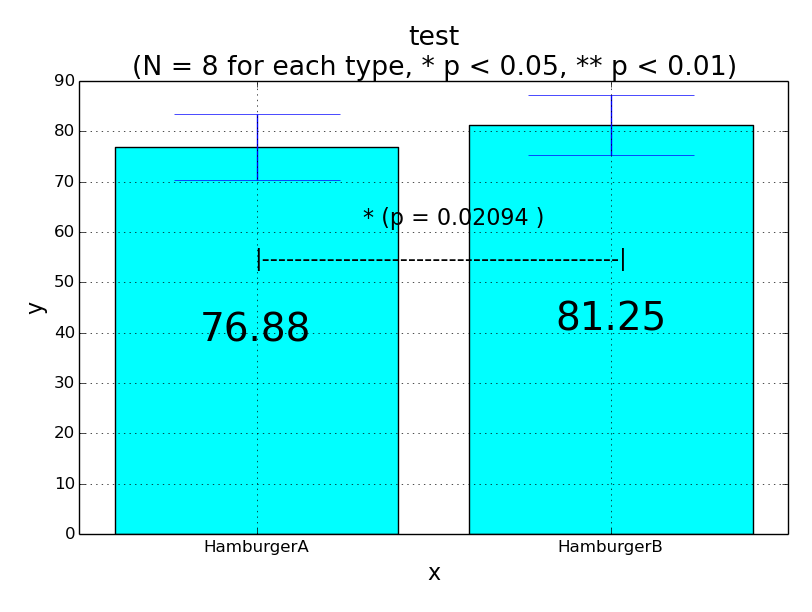

# T検定

## 説明
- 各条件の平均値の差を比較する
- 前提：対応ありの場合、各組のサンプル数は同じ

## サンプル
```src/sample_t_test.py```

## 1. 対応のないt検定

- 条件A, Bの比較をする時に、各々の条件を別の人が試している時に用いる
- sample:
```python sample_t_test.py 1```


```python sample_t_test.py 2```


## 2. 対応のあるt検定

- 条件A, Bの比較をする時に、各々の条件を同じ人が試している時に用いる
- sample:
```python sample_t_test.py 3```


# 分散分析
- parametric検定

## 1. 一元配置

### 説明
- 分析対象の要因が1つで、その1つが3つ以上の水準に分かれている時に用いる
- 前提：被験者内計画の場合、各条件のサンプル数は同じ

#### 前提
- 1. normality: 正規分布
- 2. equality of variance: ２つの母集団の分散が等しいこと (F検定(ハートレイ検定)を用いる)
- 3. independence: 標本が母集団から無作為に抽出されること
- 4. 被験者内計画のみ：分散共分散行列の等質性をチェックする必要がある
(モークリー(Mauchly) の球面性の検定)
- 5. 被験者内計画のみ：各カテゴリのサンプル数が同じことが前提

% 要因ごとのデータ数に偏りがある場合はnon-parametric検定を用いる

### サンプル
```
src/sample_one_way_anova.py
```

### one-way factrial ANOVA (一元配置要因分散分析、被験者間計画)
- sample:
```python sample_t_test.py between```


### one-way repeated measures ANOVA (一元配置反復測定分散分析、被験者内計画)
- sample:
```python sample_t_test.py within```


### 参考サイト
[R言語で統計解析入門](http://monge.tec.fukuoka-u.ac.jp/r_analysis/test_anova03.html)
[一元配置分散分析](https://ultrabem.jimdo.com/statistics/mean/anova1/)

## 2. 二元配置

- 分析対象の要因が2つで、その2つを組み合わせて分析を行う時に用いる