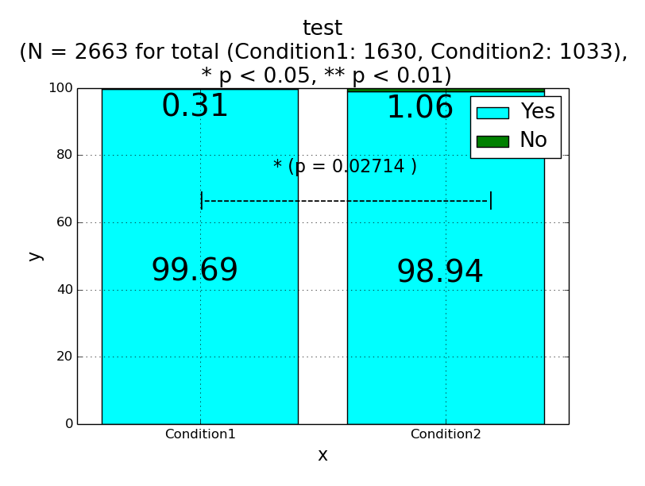

# 2標本検定

## 同じ被験者に体験前後でアンケート (対応有り)

- Yes/ No 形式 (名義尺度)：マクネマーの検定
- グレード形式 (順位尺度)：ウィルコクソンの符号付き順位検定


## 同じ被験者のふれ合いについて、計量尺度に基づくデータ取得 (対応有り)

- ロボット1, ロボット2とのふれ合い時間の比較 (計量尺度)：対応のあるt検定


## 条件1、条件2ごとにアンケート (対応無し)

- Yes/ No 形式 (名義尺度)：カイ2乗検定  
コクラン・ルールを満たさない場合：フィッシャーの正確検定  
最近は、パソコンで計算できるからどんなときもフィッシャーの正確検定を用いるべきという意見もある。しかし、このパッケージではpythonでのオーバーフローの問題を回避できないので、コクラン・ルールを満たすかどうかの判定を行う。 

- グレード形式 (順位尺度)：ウィルコクソンの2標本検定/ ウィルコクソンの順位和検定/ マン・ホイットニィのU検定


## 条件1、条件2ごとに、計量尺度に基づくデータ取得 (対応無し)

- 条件ごとのふれ合い時間の比較 (計量尺度)：対応のないt検定

## サンプル

- 対応のある順位尺度検定
```python sample_u_test.py 1```


- 対応のあるt検定

```python sample_t_test.py 3```


- カイ二乗検定
```python sample_chi_squared_test.py```


- 対応のないU検定
```python sample_u_test.py 2```


- 対応のないt検定
```python sample_t_test.py 1```


```python sample_t_test.py 2```


# 多標本検定(一元配置: 要因は1つ)

## 同じ被験者のふれ合いについて、計量尺度に基づくデータ取得 (対応有り)

- 1回の実験。ロボット1, ロボット2, ロボット3とのふれ合い時間の比較 (計量尺度)：  
-- 対応のある一元配置分散分析  
-- 要因A：ロボットの種類

## 違う被験者のふれ合いについて、計量尺度に基づくデータ取得 (対応無し)

- ロボット1, ロボット2, ロボット3それぞれのふれ合い時間の比較 (計量尺度)：  
-- 対応のない一元配置分散分析  
-- 要因A：ロボットの種類  要因B: 個人差  

# 多標本検定(二元配置: 要因は2つ)

## 繰り返し有り

- 「あるロボット」（複数の種類があり、1つ選ぶ）と「あるふれ合い方」（複数のふれ合い方があり、1つ選ぶ）の条件で、ロボットと複数の人に*1回*ふれ合ってもらう。  
例えば2条件、2条件ずつであれば、4群分被験者がいる。ある1群に10人いるとすると、その10人で条件を繰り返すので「繰り返し有り」と言う。
-- 繰り返しのある二元配置  
-- 要因A: ロボットの種類、要因B: ロボットのふれ合い方  

- 「あるロボット」（複数の種類があり、1つ選ぶ）と「あるふれ合い方」（複数のふれ合い方があり、1つ選ぶ）の条件で、ロボットと複数の人に*長期的に*ふれ合ってもらう。  この時繰り返しのある二元配置になるが、個人差が残差に含まれてしまうことになる。一般的に個人差は大きくなるので良くない。  
そこで個人差を残差から分離する。
-- 繰り返し測定型二元配置分散分析    
-- 要因A: ロボットの種類、要因B: ロボットのふれ合い方 =>   
要因A: ロボットの種類、要因B: ロボットのふれ合い方、SUB: 被験者

## 繰り返しなし

- あるロボット（1種類）と複数人に長期間ふれ合ってもらう。  
例えば1ヶ月おきに評価のためのデータを取る。  
-- 繰り返しのない二元配置  
-- 要因A: 時期、要因B: 個人差   
-- (memo) 対応のある一元配置分散分析と計算方法が同じ  

- 複数人にまずロボットAと長期間ふれ合ってもらい、次にロボットBと長期間ふれ合ってもらう。  
例えば1ヶ月おきに評価のためのデータを取る。  
-- 繰り返しのない三元配置  
-- 要因A: 個人差、要因B: 時期、要因C: ロボットの種類  
-- (memo) ロボットの種類による影響を時期ごとの変化量で見る場合、要因Cを考慮しなくてよくなる
  
## サンプル

- one-way factrial ANOVA (一元配置要因分散分析、被験者間計画)
```python sample_t_test.py between```


- one-way repeated measures ANOVA (一元配置反復測定分散分析、被験者内計画)
```python sample_t_test.py within```


